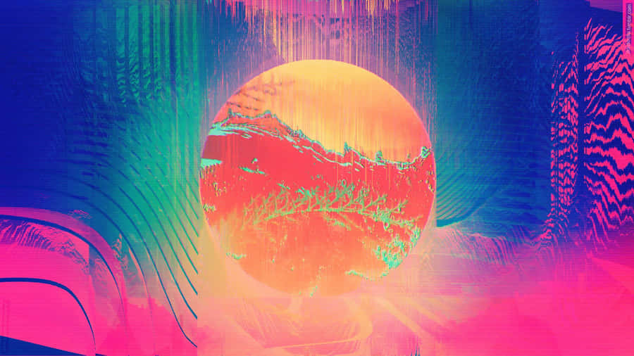

# xzhe9204_9103_tut6

## Part 1: Imaging Technique Inspiration

Inspired by the aesthetics of **glitch art**,  use digital errors or distortions to create visually compelling abstract visual effects. This technique often involves manipulating image pixels, corrupting data, or shifting color channels to simulate technical glitches. Aesthetics include digital noise, screen tearing, or pixelated chaos to create fragmented images.

My goal is to incorporate pixel scrambling and color shifting into my projects, combining pixel displacement and color channel shifting to evoke a sense of fragmentation and chaos to create a unique sense of fragmentation and unpredictability. This technique was essential to the assignment's creative exploration of image processing.

## Part 2: Coding Technique Exploration

To achieve a glitchy artistic aesthetic, I explored several creative coding examples that utilize pixel manipulation and visual distortion techniques.

- Examples:
1."https://openprocessing.org/sketch/2136720"
2."https://openprocessing.org/sketch/2242345"
3."https://openprocessing.org/sketch/2325217"
4."https://openprocessing.org/sketch/735606"
5."https://openprocessing.org/sketch/1353598" 
6."https://openprocessing.org/sketch/2135557" 
7."https://openprocessing.org/sketch/2206700"

Use **'graph drawing'**, **'randomization function'**, **'image manipulation techniques'**, **'pixel manipulation'**, **'pixel manipulation'**, **'line drawing'**, **'randomization function'**, **'image manipulation techniques'**, **'pixel manipulation'**, **'pixel manipulation'**, **'pixel manipulation'**, **'randomized displacement'**, **'line drawing'** , **'pixel jamming'**, **'randomized pixel'** and **'color warping'** coding techniques.

By accessing and manipulating pixel arrays using the `get()` ,`set()`, `loadPixels()` and `updatePixels()` etc functions in p5.js, it is possible to randomize pixel positions and color channels to achieve pixel misalignment and color shifting effects. Create unique digital noise, screen tearing and pixelated chaos that perfectly mimics the aesthetics of technical glitches. Randomization of lines and color misalignment greatly enhances the visual fragmentation and chaos

