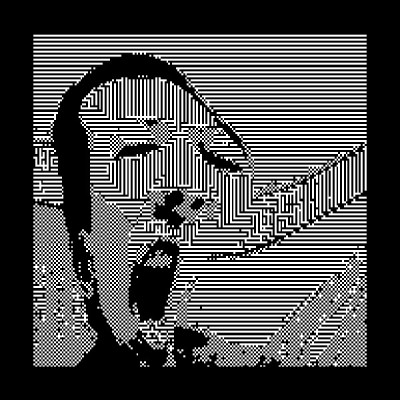

# xzhe9204_9103_tut6

# Quiz 8: Imaging and Coding Technique Inspiration

## Part 1: Imaging Technique Inspiration

### Imaging Technique: **Double Exposure Effect**

Inspired by the aesthetics of glitch art, I use digital errors or distortions to create visually compelling abstract visual effects. This technique often involves manipulating image pixels, corrupting data, or shifting color channels to simulate technical glitches. Aesthetics include digital noise, screen tearing, or pixelated chaos to create fragmented images.

My goal is to incorporate pixel scrambling and color shifting into my projects, combining pixel displacement and color channel shifting to evoke a sense of fragmentation and chaos to create a unique sense of fragmentation and unpredictability. This technique was essential to the assignment's creative exploration of image processing.

## Part 2: Coding Technique Exploration

